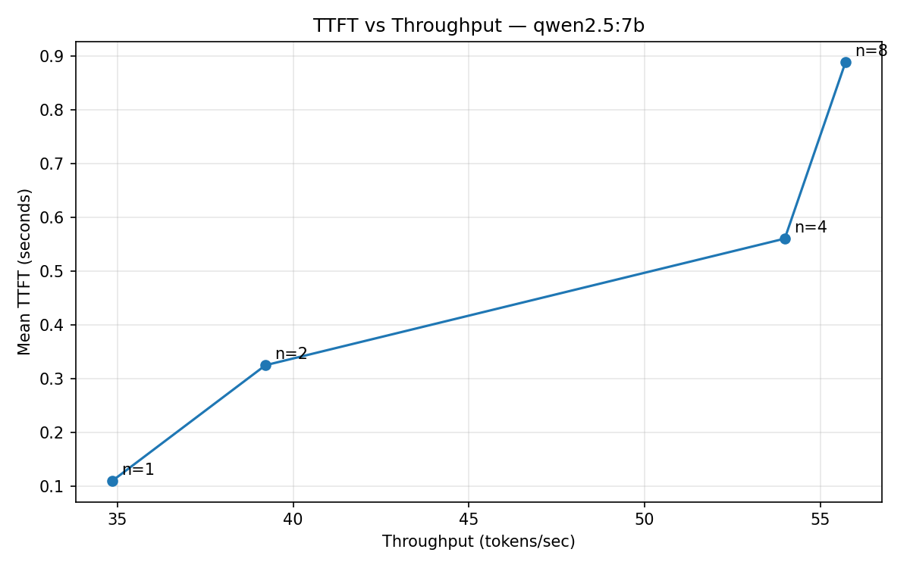

# Inference Benchmarking Harness

Measure the TTFT vs throughput tradeoff under concurrent load for local LLM inference servers (Ollama, llama.cpp).

## Method

Sweeps concurrency levels (e.g. 1, 2, 4, 8 simultaneous requests) against a local model server, measuring:

- **TTFT (time-to-first-token):** wall-clock time from request send to first streamed token
- **Throughput:** total output tokens across all concurrent requests / wall-clock time

Outputs a JSON results file and a TTFT-vs-throughput plot showing where the system saturates.

## Setup

```bash
python -m venv .venv && source .venv/bin/activate
pip install -r requirements.txt
```

Requires a running Ollama server:

```bash
OLLAMA_NUM_PARALLEL=8 ollama serve
```

## Usage

```bash
python run.py --model qwen2.5:7b --levels 1 2 4 8
python run.py --model qwen2.5:3b --levels 1 2 4 8 16 --max-tokens 256 --prompt short
```

Results (JSON + PNG plot) are written to `results/`.

## Key findings

### (qwen2.5:7b on Apple M2 Pro, 11.8 GiB)

With the default `NUM_PARALLEL=1`, Ollama serializes requests. Throughput stays flat
at ~34 tps regardless of concurrency, and TTFT grows linearly (28s at n=8) -- pure
queueing delay with zero batching benefit.

With `NUM_PARALLEL=8`, batching is enabled. The server reads weight matrices once and
applies them to multiple sequences per forward pass, amortizing memory bandwidth:

| Concurrency | Mean TTFT | Throughput (tok/s) |
|-------------|----------:|-----------:|
| 1           | 0.11s     | 34.9       |
| 2           | 0.33s     | 39.2       |
| 4           | 0.56s     | 54.0       |
| 8           | 0.89s     | 55.7       |



### Saturation and roofline analysis

Throughput plateaus at ~55 tps (n=4 to n=8 gained only 3%).

LLM token decoding is memory-bandwidth-bound. The arithmetic intensity (FLOPs per byte
transferred) is low at small batch sizes.

**Stats**:

- **M2 Pro memory bandwidth:** 200 GB/s
- **qwen2.5:7b (Q4 quantized):** 4.7 GB on disk
- **Theoretical peak (batch=1):** 200 / 4.7 = ~42 tok/s
- **Observed (batch=1):** 35 tok/s (~83% efficiency, remaining overhead from KV cache reads and scheduling)

With batching, weights are read once and applied to N sequences per forward pass,
amortizing the bandwidth cost. If weight reads were the only bottleneck, batch=4
would give ~4x throughput (170 tps). Instead we observe 54 tps (1.54x).

**KV cache:** Each sequence maintains key/value activations
across all layers. At batch=8, KV cache reads grow large enough to compete with
weight reads for memory bandwidth. This is why throughput flatlines at ~55 tps. The bandwidth
budget is consumed by KV cache, not weights.

Beyond n=8, TTFT would climb with no throughput gain.

### Benchmarking methodology

- A warmup request runs before the sweep to avoid cold-start bias (model loading
  inflated the first TTFT by ~12s in initial runs)
- Each concurrency level runs to completion (barrier synchronization) before the
  next level starts, ensuring clean per-level measurements
- Token counts come from the API's usage field, not local tokenization